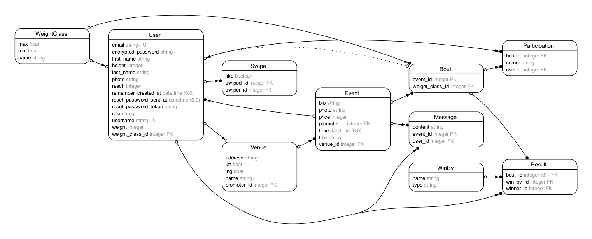

# BoutBuddy

A web application that aims to connect fighters with fights and viewers with events.

## Pain Point

Marketing this product will be difficult but adaption of it will grow the sport.

## User Stories

- As a promoter, I want to be able to create events so that fighters can sign up for them.
- As a promoter, I want to be able to confirm the matches and set a limit on the number of matches, so I can control the time of the event.
- As a fighter, I want to be able to browse events or find people in my weight class that don't have an opponent yet, so I can get practice in.
- As both promoter, fighter or just user, I want to be able to browse events to attend, so I can support local fighters.
- As a fighter, I would like a "pre fight conference" in which we can all type on a public forum, so we can build up the fight.

## Domain Model

### User

- id
- email
- username
- first_name
- last_name
- password
- photo_url
- weight
- reach
- height
- weight_class_id
- role

### Event

- id
- venue_id
- title
- time
- price
- bio
- promoter_id

### Bout

- id
- event_id
- weight_class_id

### Venue

- id
- name
- lat
- lng
- address
- promoter_id

### Weight Class

- id
- name
- min
- max

### Message

- id
- event_id
- user_id
- content

### Swipes

- id
- swiper_id
- swiped_id
- like:bool

### Participation

- id
- user_id
- bout_id
- corner: red/blue

## ERD

