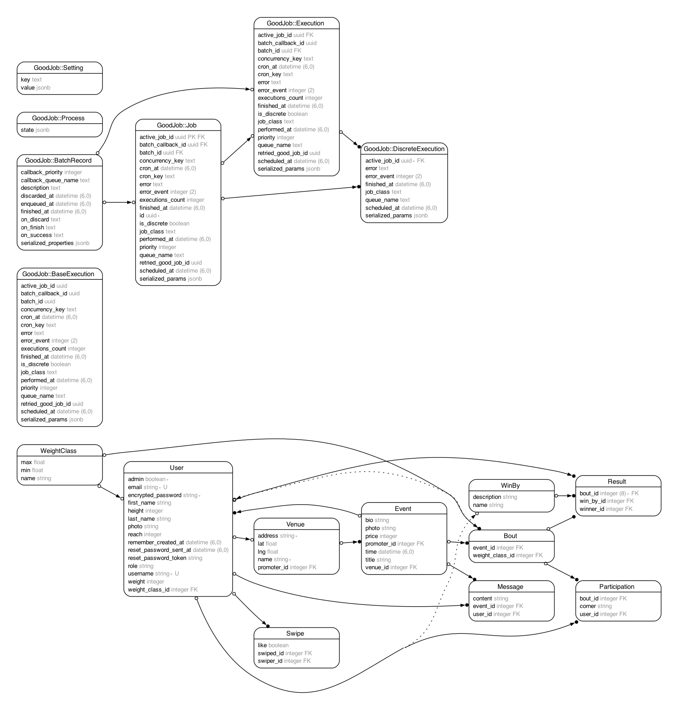

# BoutBuddy

BoutBuddy is a web application designed to bridge the gap between fighters, promoters, and fans in the world of combat sports. This platform facilitates the discovery and promotion of fight events, enables fighters to find and sign up for bouts, and allows fans to follow and attend events.

## Table of Contents
- [About BoutBuddy](#about-boutbuddy)
- [Features](#features)
- [Getting Started](#getting-started)
  - [Prerequisites](#prerequisites)
  - [Installation](#installation)
- [API Usage](#api-usage)
  - [Cloudinary](#cloudinary)
  - [Google Maps](#google-maps)
- [Contribution Guide](#contribution-guide)
- [Contact](#contact)
- [ERD](#erd)

## Features

- **Event Creation and Management**: Promoters can create and manage events, setting up the foundation for bouts and inviting fighters to participate.
- **Fighter Profiles and Records**: Fighters can maintain their profiles, search for events, and track their match records over time.
- **Matchmaking**: A system that allows fighters to find opponents in their weight class, ensuring fair and competitive bouts.
- **Pre-Fight Engagement**: A public forum for fighters to engage with their fans and build up hype for upcoming fights.
- **Event Discovery**: Fans can discover events, follow their favorite fighters, and keep track of upcoming bouts.

## Getting Started

### Prerequisites

- Ensure you have Rails 7.0.8 installed.
- Ensure you have Ruby 3.2.1 installed.
- Ensure you have PostgreSQL 14.9 installed.
- Ensure you have Bundler 2.4.6 installed.

### Installation

To get BoutBuddy up and running on your local machine, follow these steps:

1. Clone the repository to your local machine:

    ```bash
    git clone https://github.com/aldoportillo/boutbuddy
    ```

2. Navigate to the application directory:

    ```bash
    cd BoutBuddy
    ```

3. Install the required Ruby gems by running Bundler (make sure you have Bundler installed):

    ```bash
    bundle install
    ```

4. Since this application uses PostgreSQL, ensure you have PostgreSQL installed and running on your machine. Then create and migrate the database:

    ```bash
    rails db:create db:migrate
    ```

5. To populate the database with initial data, run the sample data task:

    ```bash
    rake sample_data
    ```

6. Start the Rails server:

    ```bash
    rails server
    ```

7. Visit `http://localhost:3000` in your web browser to view the application.

## API Usage

### Cloudinary
BoutBuddy uses Cloudinary for efficient image management. Cloudinary provides an end-to-end image and video management solution. In BoutBuddy, Cloudinary is used for:
- Uploading and storing images of fighters and events.
- Transforming and optimizing images for various devices and screen sizes.
- Delivering images through a fast Content Delivery Network (CDN).
- Clearing the background of a fighter's image.

### Google Maps
Google Maps API is integrated into BoutBuddy to enhance the event discovery experience. It allows users to:
- View the locations of fight events on a map.
- Get directions to event venues.
- Search for events based on location.

## Contribution Guide

Contributions to BoutBuddy are greatly appreciated. If you would like to contribute, please follow these guidelines:

1. **Fork the Repository**: Create your own fork of the BoutBuddy repository.
2. **Create a Branch**: For each new feature or bug fix, create a new branch based on the 'main' branch.
3. **Make Changes**: Implement your feature or bug fix.
4. **Document Changes**: Update the documentation to reflect any changes you've made.
5. **Submit a Pull Request**: Once your changes are complete, submit a pull request to the 'main' branch of the original BoutBuddy repository.

Before contributing, please read through the existing issues and pull requests to ensure that someone else isn't already working on similar changes.

## Contact

Aldo Portillo - [LinkedIn](https://www.linkedin.com/in/aldoportillo/) – [Instagram](https://www.instagram.com/portillo.mma/) – [Twitter](https://twitter.com/aldoportillodev)

Project Link: [https://github.com/aldoportillo/boutbuddy](https://github.com/aldoportillo/boutbuddy)

## ERD

